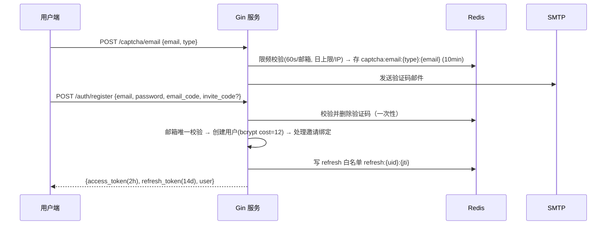
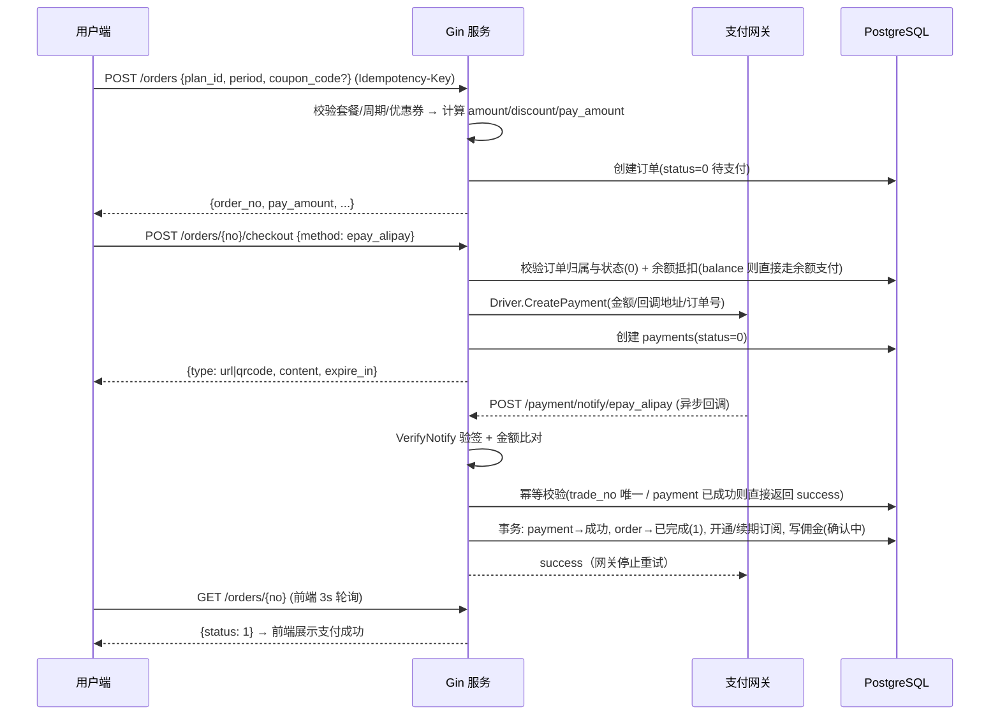

# 后端开发文档 · 核心业务流程

> 关键链路的时序与状态机定义，是 service 层实现与联调的依据。接口字段以 [../api/README.md](../api/README.md) 为准，表结构以 [data-model.md](data-model.md) 为准。

## 1. 注册 / 登录 / 找回密码



要点：
- 邀请绑定：`invite_code` 有效且非本人 → `users.invite_by_id = 邀请人`，`invite_codes.used_count+1`；自邀/多级邀请不处理（只记一级）。
- 登录：校验密码 → 失败计数（5 次锁 10 分钟）→ 签发 token 对；`is_banned` 用户拒绝登录。
- 刷新：`POST /auth/refresh` 校验 refresh 白名单与签名，旋转签发新 token 对（旧 jti 立即失效）。
- 找回密码：验证码通过后重置密码，并吊销该用户全部 refresh（重新登录）。
- 登出：删除当前 jti 白名单记录。

## 2. 下单与在线支付（核心交易链路）



### 2.1 开通/续期规则（MarkPaid 事务内）

| 场景 | 规则 |
|---|---|
| 无订阅 / 已过期 / 不同套餐 | `plan_id/expired_at/transfer_enable/限速/设备数` 替换为新套餐；`expired_at = max(now, 原expired_at) + 周期时长`；用量 `u/d` 清零 |
| 同套餐续费（未过期） | `expired_at += 周期时长`；`transfer_enable += 套餐流量`；`u/d` 不清零（周期流量叠加） |
| 一次性套餐 | 只叠加 `transfer_enable`，不改 `expired_at` |

### 2.2 余额支付

`checkout {method: balance}`：校验 `balance >= pay_amount` → 事务内扣减余额 + 记 `balance_used` → 走与在线支付相同的 MarkPaid 后置逻辑（开通订阅/写佣金）。余额与在线支付组合抵扣一期不做（下单时二选一：余额足够则全额抵扣，不足则提示走在线支付全额）。

### 2.3 关单与兜底

- 订单 30 分钟未支付由 cron 关闭（status=2），关闭后不可再支付，需重新下单。
- 回调丢失兜底：cron 每 10 分钟对「待支付 + 已创建 payment」的订单调 `Driver.Query` 主动查单，网关显示已支付则补走 MarkPaid。
- 前端任何「我已支付」声明都不被信任，以回调/查单为准。

## 3. 优惠券校验

`POST /coupons/check {code, plan_id, period}` → 校验：存在且启用、在有效期内、适用套餐/周期、用户未超使用次数、满足门槛金额 → 返回 `discount_amount` 与试算后 `pay_amount`（纯试算不落库）。下单时服务端**重新校验并重新计算**，前端试算结果仅作展示。

## 4. 佣金链路（邀请赚钱）

```mermaid
sequenceDiagram
    participant B as 被邀请人
    participant S as Gin 服务
    participant C as Cron
    participant A as 邀请人
    B->>S: 注册(invite_code) → invite_by_id 绑定 A
    B->>S: 下单并支付成功
    S->>S: 若 B 存在 invite_by_id: 写 commission_logs(status=0 确认中, rate=下单时配置快照)
    Note over C: 每日任务: status=0 且 paid_at > N 天(默认3)
    C->>S: status→1 已发放, A.commission_balance += amount
    A->>S: POST /invite/transfer {amount}
    S->>S: 事务: commission_balance -= amount, balance += amount
    Note over S: 若订单退款: 对应佣金 status=0→2 撤销; 已发放的从 balance 扣回(可为负, 记录审计)
```

- 佣金比例：默认取 settings `invite_commission_rate`（如 40%）；代理商（role=2）取 `agent_commission_rate`，可不同。
- 循环佣金：被邀请人每次付费（含续费）都产生佣金，截图中「40%（循环）」即此语义。
- **余额支付不产生佣金**：仅在线支付渠道（epay 等）支付成功后写佣金；`grantCommission` 对 `pay_method = balance` 的订单直接跳过。历史已产生的余额支付佣金不受影响。

## 5. 代理商申请

1. `GET /agent/status` 返回：是否已是代理、审核状态、条件达成情况（有效邀请人数 ≥ 阈值 50、无封禁记录）。
2. 条件满足 → `POST /agent/apply` 写入申请（status=审核中）→ 管理端审核通过 → `role=2`。
3. 有效邀请定义：`invite_by_id=我` 且（有付费订单 或 注册满 N 天未封禁），阈值取 settings。
4. 审验周期（截图「12 个月」）：cron 每月 1 日 03:00 复核代理仍满足有效人数，不满足则降级 `role=0`（已实现，见 progress.md §2.5；「通知」动作未实现）。

## 6. 订阅下发

```mermaid
sequenceDiagram
    participant C as 代理客户端(Clash/sing-box)
    participant S as Gin 服务
    C->>S: GET /client/subscribe/{token}?flag=clash
    S->>S: token→用户; 校验封禁/订阅存在; 限流
    S->>S: 按 flag 或 UA 选择生成器; 取用户 group_ids 内 is_show 节点
    S-->>C: 配置内容 + Header(subscription-userinfo, profile-update-interval)
```

- UA 嗅探规则：`clash` 关键词 → Clash YAML；`sing-box` → sing-box JSON；`shadowrocket/v2ray` 及其他 → base64 分享链接。
- `subscription-userinfo: upload={u}; download={d}; total={transfer_enable}; expire={unix(expired_at)}`，读 `sub:userinfo:{token}` 缓存（30s）。
- **每用户独立凭证（迁移 0004 起，需节点显式启用）**：节点 `servers.config` 设置 `per_user_credentials: true` 后，下发配置中的密码/uuid 为 `users.uuid`（注册时生成），同一节点对不同用户下发不同凭证；未设置时保持下发 `servers.config` 的共享密码/uuid，避免存量节点 inbound 尚未配发时订阅刷新即断连。节点按凭证区分用户流量（模式 A 归因依据）。
- 过期或流量用尽：仍返回配置（让客户端可用但节点失效由网关侧控制），同时在配置中注入一个「到期/流量耗尽提示节点」（名称含说明文字），引导用户回站续费。
- 重置订阅：`POST /user/subscribe/reset` 生成新 `sub_token`，旧 token 立即失效（缓存同步清除）。

## 7. 工单流转

- 用户创建（status=0 待回复）→ 客服回复（status=1 已回复，last_reply_at 更新）→ 用户再回复（回到 0）→ 任一方关闭（status=2；**「只允许重开一次」**：关闭后用户可 `POST /tickets/{id}/reopen` 重开，状态回 0 且 `reopen_count+1`，整个工单生命周期最多一次，已重开返回 14002）。
- 用户侧轮询发现 status 变为「已回复」时触发本地通知（桌面端）/ 红点。

## 8. 流量数据来源（两种模式均已实现）

- **模式 A（节点上报，已实现）**：节点 agent 以 `X-Node-Key`（每节点独立密钥，`servers.node_key`）调用两组接口：
  - `GET /node/users` 拉取本节点分组下有效订阅用户（uuid/u/d/transfer_enable/expired_at），据此配置 inbound 每用户凭证并做本地掐断；
  - `POST /node/report` 定时（建议 60s）上报**每用户累计值** `[{uuid, u, d}]`。服务端流程：`node_user_stats` 快照差分得增量（重复上报差分 0，天然幂等；累计值回退视为节点计数器重启，增量取当前值）→ 增量 × 节点 `rate` → 事务内累加 `users.u/d` + `traffic_logs` 增量聚合（`ON CONFLICT DO UPDATE SET u = u + ?`）→ 删除受影响用户 `sub:userinfo:{token}` 缓存。同一 UUID 在单次请求重复出现会整体拒绝（`duplicate_uuid`）；未知 uuid、套餐分组不包含本节点、无订阅/封禁/过期用户跳过并在响应 `skipped` 返回。
  - 归因前提：节点 config 已开启 `per_user_credentials: true`，订阅下发 `users.uuid`（见第 6 节），节点 inbound 按凭证区分用户；存量节点应先配发每用户 inbound，再开启该开关。
- **模式 B（手工/对账，一期）**：管理端可手工录入或导入流量数据（**覆盖**式，同日导入覆盖模式 A 聚合值，作为校准手段）；`traffic_logs` 有数据则前端展示，无数据显示空态。
- 演示工具：`server/cmd/node-agent` 模拟累计值定时上报，本地全链路联调（首轮先上报 0 基线建立快照）；真实代理后端（Xray stats 等）对接见 [node-agent-guide.md](node-agent-guide.md)。
- 流量用尽（u+d ≥ transfer_enable）或到期：MarkPaid 之外的独立校验，订阅下发与提醒逻辑均以此判断；`remind_traffic=1` 且用量 ≥80% 时发一次提醒邮件（Redis 记录已提醒标记，周期内不重复）。

## 9. 定时任务总览（cmd/worker，robfig/cron）

| 任务 | 周期 | 内容 |
|---|---|---|
| close-expired-orders | 每 5 分钟 | 关闭 30 分钟未支付订单 |
| reconcile-payments | 每 10 分钟 | 对待支付 payment 主动查单补账 |
| confirm-commissions | 每日 02:00 | 确认中佣金满 N 天转已发放并入 commission_balance |
| expire-remind | 每日 10:00 | 到期前 3/1 天且开启提醒的用户发邮件 |
| agent-audit | 每月 1 日 03:00 | 代理商有效人数复核降级 role=0 |
| traffic-daily | 每日 01:00 | 流量日结转/汇总校验（模式 B 下可空跑） |

所有任务加 `cron:lock:{job}` 分布式锁，支持多实例部署安全。

## 10. 通知邮件模板

统一 HTML 模板（品牌头 + 内容 + 页脚）：验证码、注册欢迎、到期提醒、流量提醒、支付成功回执（已实现：在线回调与余额支付成功后异步发送，见 progress.md §2.6）。模板存 settings，支持变量替换（`{site_name} {code} {expired_at}` 等）；发送失败重试 2 次并记录日志，不阻塞主流程（异步 goroutine + 限流）。
