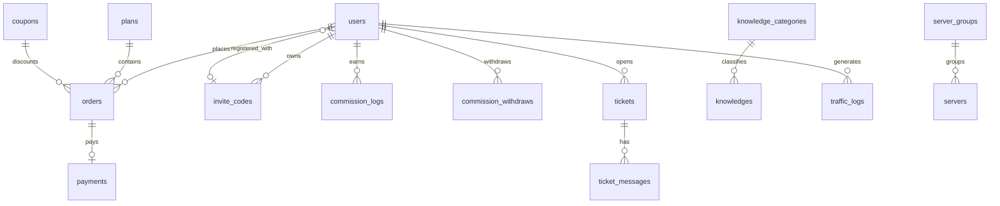

# 后端开发文档 · 数据模型

> PostgreSQL 16，金额字段一律 `BIGINT` 存「分」，流量字段一律 `BIGINT` 存「字节」。所有表含 `created_at` / `updated_at`（TIMESTAMP(3)），软删除仅在标注的表使用。迁移用 golang-migrate 顺序执行。

## 1. ER 概览

## 2. 表结构

### 2.1 users（用户）

| 字段 | 类型 | 说明 |
|---|---|---|
| id | BIGSERIAL PK | — |
| email | VARCHAR(190) UNIQUE NOT NULL | 登录账号 |
| password_hash | VARCHAR(255) NOT NULL | bcrypt cost=12（`internal/pkg/passwd`） |
| role | SMALLINT NOT NULL DEFAULT 0 | 0=用户 1=管理员 2=代理商 |
| balance | BIGINT NOT NULL DEFAULT 0 | 钱包余额（分） |
| commission_balance | BIGINT NOT NULL DEFAULT 0 | 可划转佣金（分） |
| invite_by_id | BIGINT NULL | 邀请人 user id |
| is_banned | BOOLEAN NOT NULL DEFAULT 0 | 封禁标记（封禁即拒绝登录与订阅下发） |
| remind_expire | BOOLEAN NOT NULL DEFAULT 1 | 到期邮件提醒开关 |
| remind_traffic | BOOLEAN NOT NULL DEFAULT 0 | 流量邮件提醒开关 |
| telegram_id | BIGINT NULL | F12 Telegram 绑定（chat id）；部分唯一索引 `uk_users_telegram WHERE telegram_id IS NOT NULL`（迁移 0008），一个 chat 仅绑定一个账号 |
| plan_id | BIGINT NULL | 当前订阅套餐（无订阅为 NULL） |
| expired_at | TIMESTAMP(3) NULL | 订阅到期时间 |
| transfer_enable | BIGINT NOT NULL DEFAULT 0 | 套餐总流量（字节） |
| u | BIGINT NOT NULL DEFAULT 0 | 已用上行（字节） |
| d | BIGINT NOT NULL DEFAULT 0 | 已用下行（字节） |
| speed_limit | INT NULL | 套餐限速 Mbps（快照） |
| device_limit | INT NULL | 同时在线设备数（快照） |
| sub_token | CHAR(36) UNIQUE NOT NULL | 订阅 token（UUID，可重置） |
| uuid | CHAR(36) UNIQUE NOT NULL | 用户订阅凭证（迁移 0004 新增，2026-08-22）：vmess/vless/tuic 的 uuid、shadowsocks/trojan/hysteria2 的密码，节点上报按此归因 |

索引：`(plan_id, expired_at)`（到期提醒扫描）、`invite_by_id`。

设计说明：采用「单活跃用户订阅」模型（订阅字段内嵌 users，类 V2board），同一时刻只有一个生效套餐；续费/改购直接在原字段上叠加或替换，历史归属由 orders 表追溯。

### 2.2 plans（套餐）

| 字段 | 类型 | 说明 |
|---|---|---|
| id | BIGSERIAL PK | — |
| name | VARCHAR(64) NOT NULL | 如「白羊座」 |
| content | TEXT | 描述富文本/Markdown（含营销文案，入库前清洗） |
| month_price | BIGINT NULL | 月付价（分），NULL=不支持该周期 |
| quarter_price / half_year_price / year_price / onetime_price | BIGINT NULL | 季/半年/年/一次性 |
| traffic_gb | INT NOT NULL | 每周期流量 GB |
| speed_limit | INT NULL | 限速 Mbps，NULL=不限制 |
| device_limit | INT NULL | 同时在线设备数 |
| group_ids | JSONB NOT NULL | 可用节点分组 id 数组 |
| is_show | BOOLEAN DEFAULT 1 | 是否上架 |
| sort | INT DEFAULT 0 | 排序 |

### 2.3 orders（订单）

| 字段 | 类型 | 说明 |
|---|---|---|
| id | BIGSERIAL PK | — |
| order_no | VARCHAR(32) UNIQUE NOT NULL | 订单号（日期+随机，如 `2026062400063525438887716`） |
| user_id | BIGINT NOT NULL INDEX | — |
| plan_id | BIGINT NOT NULL | — |
| period | VARCHAR(16) NOT NULL | `month/quarter/half_year/year/onetime` |
| amount | BIGINT NOT NULL | 套餐原价（分） |
| discount_amount | BIGINT NOT NULL DEFAULT 0 | 优惠金额（分） |
| balance_used | BIGINT NOT NULL DEFAULT 0 | 余额抵扣（分） |
| pay_amount | BIGINT NOT NULL | 应付（分）= amount − discount − balance_used |
| coupon_id | BIGINT NULL | 使用的优惠券 |
| status | SMALLINT NOT NULL DEFAULT 0 | 0=待支付 1=已完成 2=已取消 3=已退款 |
| pay_method | VARCHAR(32) NULL | `balance / epay_alipay / epay_wxpay ...` |
| paid_at | TIMESTAMP(3) NULL | — |
| idempotency_key | VARCHAR(64) NULL UNIQUE | 下单幂等键 |

索引：`(user_id, status, created_at)`。状态机：0→1（支付成功）/ 0→2（取消或超时关闭）/ 1→3（管理端退款）。

### 2.4 payments（支付单）

| 字段 | 类型 | 说明 |
|---|---|---|
| id | BIGSERIAL PK | — |
| order_no | VARCHAR(32) NOT NULL INDEX | 关联订单 |
| user_id | BIGINT NOT NULL | — |
| method | VARCHAR(32) NOT NULL | 支付渠道码 |
| amount | BIGINT NOT NULL | 实收（分） |
| trade_no | VARCHAR(64) NULL UNIQUE | 网关流水号（回调幂等约束） |
| status | SMALLINT NOT NULL DEFAULT 0 | 0=待支付 1=成功 2=失败/关闭 |
| notify_payload | TEXT NULL | 回调原文（排障） |
| paid_at | TIMESTAMP(3) NULL | — |

### 2.5 coupons（优惠券）/ coupon_usages（使用记录）

coupons：id、code UNIQUE、type（1=固定金额 2=百分比）、value（分 或 百分比整数）、min_spend（分，门槛）、limit_per_user、total_limit、valid_periods JSONB（限定周期）、plan_ids JSONB（NULL=全场）、started_at / ended_at、is_enable。
coupon_usages：id、coupon_id、user_id、order_no，唯一索引 `(coupon_id, user_id, order_no)`。`limit_per_user` 的并发控制：下单事务内先 `Occupy`（原子条件更新 total_limit）再对已用次数行加锁统计（`CountUsageLocked`，`SELECT ... FOR UPDATE`），配合唯一索引防止并发下单超过单人限额。

### 2.6 invite_codes（邀请码）

| 字段 | 类型 | 说明 |
|---|---|---|
| id | BIGSERIAL PK | — |
| user_id | BIGINT NOT NULL INDEX | 拥有者 |
| code | VARCHAR(32) UNIQUE NOT NULL | 8 位随机 |
| status | SMALLINT DEFAULT 1 | 1=有效 0=停用 |
| used_count | INT DEFAULT 0 | 已使用次数 |

### 2.7 commission_logs（佣金记录）

| 字段 | 类型 | 说明 |
|---|---|---|
| id | BIGSERIAL PK | — |
| invite_user_id | BIGINT NOT NULL INDEX | 获得佣金的邀请人 |
| from_user_id | BIGINT NOT NULL | 下单用户 |
| order_no | VARCHAR(32) NOT NULL | 订单佣金一单一笔（防重）；提现流水为 `w{提现单ID}` |
| order_amount | BIGINT NOT NULL | 订单实付（分，提现流水为 0） |
| rate | INT NOT NULL | 佣金比例 %（下单时快照） |
| amount | BIGINT NOT NULL | 佣金（分） |
| biz_type | SMALLINT NOT NULL DEFAULT 0 | 0=订单佣金 1=提现流水（迁移 0007 新增，F02） |
| status | SMALLINT NOT NULL DEFAULT 0 | 0=确认中 1=已发放 2=已撤销（退款时）；提现流水复用三态：0=处理中 1=已发放 2=已退回 |
| confirmed_at | TIMESTAMP(3) NULL | — |

确认中的佣金计入「确认中」统计；cron 在 T+N 天后转「已发放」并累加 `users.commission_balance`（**仅 `biz_type=0`**，提现流水由管理员手动确认，严禁 cron 自动入账）；「累计获得佣金」= 已发放 sum。`order_no` 的 UNIQUE 约束自迁移 0007 起改为**部分唯一索引**（`WHERE biz_type = 0`），提现流水 order_no 使用 `w<N>` 标记。

### 2.8 servers（节点）/ server_groups（节点分组）

server_groups：id、name、sort。
servers：id、group_id INDEX、name、type（`shadowsocks/vmess/vless/trojan/hysteria2/tuic`）、host、port、config JSONB（协议私有参数：密码/SNI/ALPN 等）、rate DECIMAL(3,1) DEFAULT 1.0（流量倍率）、tags JSONB、status SMALLINT（1=正常 2=拥挤 3=维护）、is_show、sort、node_key CHAR(32) UNIQUE NOT NULL（节点上报密钥，迁移 0004 新增；管理端可重置）。
说明：host/port/config 仅用于订阅生成，`GET /servers` 用户接口只输出 name/type/rate/status/tags；`config` 为协议私有参数 JSON，可含 `per_user_credentials: true` 开启每用户凭证。未开启时订阅继续使用 config 中的共享密码/uuid（存量节点兼容）；开启后改为每用户 `users.uuid`（config 中的密码/uuid 不再下发给用户）。

### 2.9 notices（公告）/ knowledges（知识库）/ knowledge_categories（分类，F15）

notices：id、title、content（Markdown）、is_show、sort、created_at 即展示时间；用户端展示顺序自迁移 0007 起为 `sort ASC, created_at DESC`（F15 排序即时生效）。
knowledges：id、category（展示用冗余字符串，如 `防失联/安卓配置教程/...`）、**category_id BIGINT NULL REFERENCES knowledge_categories(id) ON DELETE SET NULL**（迁移 0007 新增，F15）、title、body（Markdown）、language（`zh-CN/en-US`）、is_show、sort、updated_at（列表展示）。
knowledge_categories（迁移 0007 新增，F15）：id、language（`zh-CN/en-US`）、name（VARCHAR(64)）、sort、created_at、updated_at；唯一索引 `(language, name)`；存量数据按 `(language, category)` 去重回填。
索引：knowledges `(language, category, is_show)`、`(category_id)`；用户端分组顺序按分类 `sort`（未建行的类目按首现顺序兜底），组内条目按知识 `sort`；搜索用 `LIKE`（量级小）。

### 2.10 tickets（工单）/ ticket_messages（消息）

tickets：id、user_id INDEX、subject、level（0=低 1=中 2=高）、**type（0=普通 1=佣金提现，迁移 0007 新增，F02；level 为优先级语义勿混用）**、status（0=待回复 1=已回复 2=已关闭）、reopen_count（已重开次数，最多一次，2026-08-12 迁移 0003 新增）、last_reply_at、created_at。
ticket_messages：id、ticket_id INDEX、sender_type（0=用户 1=客服）、sender_id、message TEXT、created_at。

### 2.11 traffic_logs（流量日明细）

| 字段 | 类型 | 说明 |
|---|---|---|
| id | BIGSERIAL PK | — |
| user_id | BIGINT NOT NULL | — |
| date | DATE NOT NULL | 按天聚合 |
| u / d | BIGINT NOT NULL DEFAULT 0 | 当日上行/下行（字节，已乘倍率） |

唯一索引 `(user_id, date)`；由节点上报数据（见 core-flows.md 第 8 节）或定时任务结转写入；流量明细页按 `date` 范围查询。模式 A 节点上报走**增量聚合**（`ON CONFLICT DO UPDATE SET u = u + ?`），模式 B 手工导入为**覆盖校准**（同日导入覆盖节点上报值）。

### 2.11.1 node_user_stats（节点上报快照，迁移 0004 新增，2026-08-22）

| 字段 | 类型 | 说明 |
|---|---|---|
| id | BIGSERIAL PK | — |
| server_id | BIGINT NOT NULL | 节点 id |
| user_id | BIGINT NOT NULL | 用户 id |
| last_u / last_d | BIGINT NOT NULL DEFAULT 0 | 上次上报的累计值（字节，未乘倍率） |
| updated_at | TIMESTAMP(3) | 最近上报时间 |

唯一索引 `(server_id, user_id)`。模式 A 幂等的核心：上报累计值与快照差分得增量，重复上报差分为 0；累计值回退视为节点计数器重启（增量取当前值）。

### 2.12 settings（站点配置）/ audit_logs（审计）

settings：`key` VARCHAR(64) PK、`value` JSONB（站点名、logo、TG 链接、客服地址、佣金比例、代理条件、支付开关、SMTP 模板等）。
audit_logs：id、admin_id、action（如 `adjust_balance/refund/ban_user`）、target、detail JSONB、ip、created_at。

### 2.13 mail_logs（邮件发送日志，迁移 0005 新增，2026-08-28）

管理端向用户发送邮件的留痕（F05）：

| 字段 | 类型 | 说明 |
|---|---|---|
| id | BIGSERIAL PK | |
| user_id | BIGINT NOT NULL | 收件用户 ID，`(user_id, created_at DESC)` 索引 |
| email | VARCHAR(190) | 收件邮箱 |
| subject | VARCHAR(255) | 邮件主题（已 sanitize） |
| status | SMALLINT | 0=发送失败 1=发送成功 |
| error | VARCHAR(512) | 失败原因（SMTP 报错截断） |
| admin_id | BIGINT | 操作管理员 |
| created_at | TIMESTAMP(3) | |

批量操作 / CSV 导出 / 重置订阅密钥（F05 其余子项）不引入新表，审计统一走 `audit_logs`（新增动作 `send_mail`、`reset_sub_token`）。

### 2.14 traffic_reset_logs（流量重置记录，迁移 0006 新增，2026-08-28）

管理端按用户重置流量的留痕（F16）：

| 字段 | 类型 | 说明 |
|---|---|---|
| id | BIGSERIAL PK | |
| user_id | BIGINT NOT NULL | 被重置用户，`(user_id, created_at DESC)` 索引 |
| admin_id | BIGINT NOT NULL | 操作管理员 |
| mode | VARCHAR(16) NOT NULL | `clear_usage`=清零用量；`reset_quota`=重新给量（按当前套餐额度） |
| before_u / before_d | BIGINT DEFAULT 0 | 重置前已用上下行（字节） |
| before_transfer_enable | BIGINT DEFAULT 0 | 重置前总额度 |
| after_transfer_enable | BIGINT DEFAULT 0 | 重置后总额度（clear_usage 不变，reset_quota=套餐流量） |
| created_at | TIMESTAMP(3) | |

重置语义（与节点上报差分幂等兼容）：重置只清零 `users.u/d`（`reset_quota` 另重置 `transfer_enable`），**保留 `node_user_stats` 快照**——下次上报按既有累计值差分，仅重置后的新流量计入；若清空快照，节点全周期累计值会被整体重算（重复计费）。重置同时写 `audit_logs`（动作 `traffic_reset`）。

迁移 0006 同时为 F04 报表聚合补时间索引：`traffic_logs(date)`、`orders(paid_at) WHERE paid_at IS NOT NULL`（部分索引）、`users(created_at)`。

### 2.15 commission_withdraws（佣金提现单，迁移 0007 新增，2026-08-28，F02）

仅代理商工单提现的最小闭环（spec F02）：提交即扣减 `commission_balance`（行锁防双花），管理员手动确认发放（线下打款）或拒绝（自动退回）：

| 字段 | 类型 | 说明 |
|---|---|---|
| id | BIGSERIAL PK | |
| user_id | BIGINT NOT NULL | 发起代理商，`(user_id, created_at DESC)` 索引 |
| ticket_id | BIGINT NOT NULL UNIQUE | 关联提现工单（type=1），一单一单 |
| amount | BIGINT NOT NULL | 提现金额（分） |
| method | VARCHAR(32) | 提现方式（alipay/usdt/bank…） |
| account | VARCHAR(255) | 收款账号 |
| status | SMALLINT DEFAULT 0 | 0=处理中 1=已发放 2=已退回 |
| review_remark | VARCHAR(255) NULL | 管理员处理备注 |
| reviewed_at | TIMESTAMP(3) NULL | 审核时间 |
| created_at / updated_at | TIMESTAMP(3) | |

资金链路：提交（扣 `commission_balance` + 写 `commission_logs` 提现流水 status=0）→ 确认（流水 status=1，工单关闭）/ 拒绝（退回佣金 + 流水 status=2，工单关闭）。两类审核均写 `audit_logs`（`withdraw_pay`/`withdraw_reject`）；提现单与工单同事务行锁防并发双处理。

### 2.16 mail_templates（自定义邮件模板，迁移 0007 新增，2026-08-28，F11）

| 字段 | 类型 | 说明 |
|---|---|---|
| name | VARCHAR(64) PK | 模板名：`captcha` / `expire_remind` / `traffic_remind` |
| subject | VARCHAR(255) | 邮件主题模板（Go template 语法，可用 `{{.site_name}}`） |
| body | TEXT | 正文片段模板（发送时自动套品牌外壳，可用 `{{.code}}`/`{{.expire_date}}`/`{{.percent}}`） |
| updated_at | TIMESTAMP(3) | |

无自定义行（或自定义模板解析失败）时发送侧自动回退内置文案；管理端保存前校验模板可解析（防止语法错误导致发送失败），支持恢复默认与真实 SMTP 测试发送。

### 2.17 subscription_templates（自定义订阅模板，迁移 0008 新增，2026-08-29，F10）

| 字段 | 类型 | 说明 |
|---|---|---|
| name | VARCHAR(32) PK | 客户端类型：`clash` / `sing-box` / `v2ray` |
| content | TEXT | Go text/template 全文档模板；节点列表经预渲染块变量注入（clash `{{.NodeBlock}}` / sing-box `{{.Outbounds}}` / v2ray `{{.Links}}`），公共变量 `{{.SiteName}}`/`{{.UserInfo}}`/`{{.NodeCount}}` |
| updated_at | TIMESTAMP(3) | |

无自定义行（或自定义模板渲染失败）时订阅下发自动回退内置生成器（不 5xx，记 warn）；管理端保存前以示例数据渲染校验，支持预览与恢复内置。默认输出与内置生成器逐字节一致。

## 3. Redis Key 设计

| Key 模式 | 类型/TTL | 用途 |
|---|---|---|
| `captcha:email:{type}:{email}` | String，10min | 邮箱验证码；type=register/forgot |
| `captcha:rate:{email}` / `captcha:rate:ip:{ip}` | String，60s / String，24h | 发送限频与每日上限 |
| `refresh:{user_id}:{jti}` | String(JSON)，14d | refresh token 白名单（登出/改密即删）；值为会话元数据 `{ip, ua, ts}` 供 F14 会话列表展示（历史版本为字符串 "1"，降级展示） |
| `auth:kill:{user_id}` | Hash(field=jti)，14d | F14 踢下线标记：用户端踢下线指定会话写入，Auth 中间件 HExists 命中即 401（单会话 access 立即失效，不影响其余会话） |
| `login:fail:{email}` | String+INCR，10min | 登录失败锁定计数 |
| `tg:bind:code:{code}` | String(user_id)，10min | F12 Telegram 绑定验证码（单次有效，GetDel 消费） |
| `tg:bind:rate:{user_id}` | String，60s | F12 绑定验证码重发间隔 |
| `tg:bind:daily:{user_id}` | String+INCR，24h | F12 每日验证码签发上限（20 次） |
| `rl:{scope}:{key}` | 令牌桶 | 接口限流（scope=login/global/subscribe…） |
| `idem:{key}` | String（响应快照），24h | 下单幂等 |
| `order:paying:{order_no}` | String，30min | 收银台创建锁，防重复拉起支付 |
| `cache:settings` / `cache:plans` / `cache:servers` | JSON，60–300s | 热数据缓存，变更即失效 |
| `sub:userinfo:{token}` | Hash，30s | 订阅 userinfo 缓存，防客户端高频拉取打库（节点上报后主动删除，客户端立即可见新用量） |
| `node:key:{node_key}` | String(server_id)，60s | 节点密钥 → 节点 id 缓存（X-Node-Key 鉴权；重置密钥即删） |
| `cron:lock:{job}` | String+NX | 定时任务分布式锁 |

## 4. 初始化数据

迁移末尾插入：默认节点分组、演示套餐（白羊座 ¥10/300G 等四档，对齐截图）、默认 settings 行、首个管理员账号（密码哈希由环境变量注入，首次登录强制改密）。
