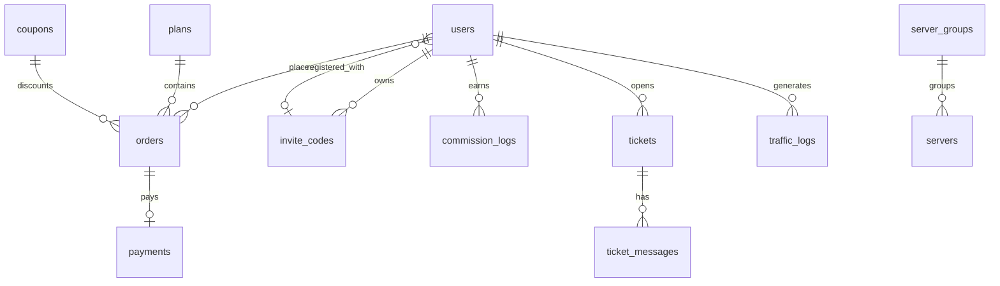

# 后端开发文档 · 数据模型

> MySQL 8（InnoDB / utf8mb4），金额字段一律 `BIGINT` 存「分」，流量字段一律 `BIGINT` 存「字节」。所有表含 `created_at` / `updated_at`（DATETIME(3)），软删除仅在标注的表使用。迁移用 golang-migrate 顺序执行。

## 1. ER 概览

## 2. 表结构

### 2.1 users（用户）

| 字段 | 类型 | 说明 |
|---|---|---|
| id | BIGINT PK AI | — |
| email | VARCHAR(190) UNIQUE NOT NULL | 登录账号 |
| password_hash | VARCHAR(255) NOT NULL | bcrypt cost=12（`internal/pkg/passwd`） |
| role | TINYINT NOT NULL DEFAULT 0 | 0=用户 1=管理员 2=代理商 |
| balance | BIGINT NOT NULL DEFAULT 0 | 钱包余额（分） |
| commission_balance | BIGINT NOT NULL DEFAULT 0 | 可划转佣金（分） |
| invite_by_id | BIGINT NULL | 邀请人 user id |
| is_banned | TINYINT(1) NOT NULL DEFAULT 0 | 封禁标记（封禁即拒绝登录与订阅下发） |
| remind_expire | TINYINT(1) NOT NULL DEFAULT 1 | 到期邮件提醒开关 |
| remind_traffic | TINYINT(1) NOT NULL DEFAULT 0 | 流量邮件提醒开关 |
| telegram_id | BIGINT NULL | TG 绑定（预留） |
| plan_id | BIGINT NULL | 当前订阅套餐（无订阅为 NULL） |
| expired_at | DATETIME(3) NULL | 订阅到期时间 |
| transfer_enable | BIGINT NOT NULL DEFAULT 0 | 套餐总流量（字节） |
| u | BIGINT NOT NULL DEFAULT 0 | 已用上行（字节） |
| d | BIGINT NOT NULL DEFAULT 0 | 已用下行（字节） |
| speed_limit | INT NULL | 套餐限速 Mbps（快照） |
| device_limit | INT NULL | 同时在线设备数（快照） |
| sub_token | CHAR(36) UNIQUE NOT NULL | 订阅 token（UUID，可重置） |

索引：`(plan_id, expired_at)`（到期提醒扫描）、`invite_by_id`。

设计说明：采用「单活跃用户订阅」模型（订阅字段内嵌 users，类 V2board），同一时刻只有一个生效套餐；续费/改购直接在原字段上叠加或替换，历史归属由 orders 表追溯。

### 2.2 plans（套餐）

| 字段 | 类型 | 说明 |
|---|---|---|
| id | BIGINT PK AI | — |
| name | VARCHAR(64) NOT NULL | 如「白羊座」 |
| content | TEXT | 描述富文本/Markdown（含营销文案，入库前清洗） |
| month_price | BIGINT NULL | 月付价（分），NULL=不支持该周期 |
| quarter_price / half_year_price / year_price / onetime_price | BIGINT NULL | 季/半年/年/一次性 |
| traffic_gb | INT NOT NULL | 每周期流量 GB |
| speed_limit | INT NULL | 限速 Mbps，NULL=不限制 |
| device_limit | INT NULL | 同时在线设备数 |
| group_ids | JSON NOT NULL | 可用节点分组 id 数组 |
| is_show | TINYINT(1) DEFAULT 1 | 是否上架 |
| sort | INT DEFAULT 0 | 排序 |

### 2.3 orders（订单）

| 字段 | 类型 | 说明 |
|---|---|---|
| id | BIGINT PK AI | — |
| order_no | VARCHAR(32) UNIQUE NOT NULL | 订单号（日期+随机，如 `2026062400063525438887716`） |
| user_id | BIGINT NOT NULL INDEX | — |
| plan_id | BIGINT NOT NULL | — |
| period | VARCHAR(16) NOT NULL | `month/quarter/half_year/year/onetime` |
| amount | BIGINT NOT NULL | 套餐原价（分） |
| discount_amount | BIGINT NOT NULL DEFAULT 0 | 优惠金额（分） |
| balance_used | BIGINT NOT NULL DEFAULT 0 | 余额抵扣（分） |
| pay_amount | BIGINT NOT NULL | 应付（分）= amount − discount − balance_used |
| coupon_id | BIGINT NULL | 使用的优惠券 |
| status | TINYINT NOT NULL DEFAULT 0 | 0=待支付 1=已完成 2=已取消 3=已退款 |
| pay_method | VARCHAR(32) NULL | `balance / epay_alipay / epay_wxpay ...` |
| paid_at | DATETIME(3) NULL | — |
| idempotency_key | VARCHAR(64) NULL UNIQUE | 下单幂等键 |

索引：`(user_id, status, created_at)`。状态机：0→1（支付成功）/ 0→2（取消或超时关闭）/ 1→3（管理端退款）。

### 2.4 payments（支付单）

| 字段 | 类型 | 说明 |
|---|---|---|
| id | BIGINT PK AI | — |
| order_no | VARCHAR(32) NOT NULL INDEX | 关联订单 |
| user_id | BIGINT NOT NULL | — |
| method | VARCHAR(32) NOT NULL | 支付渠道码 |
| amount | BIGINT NOT NULL | 实收（分） |
| trade_no | VARCHAR(64) NULL UNIQUE | 网关流水号（回调幂等约束） |
| status | TINYINT NOT NULL DEFAULT 0 | 0=待支付 1=成功 2=失败/关闭 |
| notify_payload | TEXT NULL | 回调原文（排障） |
| paid_at | DATETIME(3) NULL | — |

### 2.5 coupons（优惠券）/ coupon_usages（使用记录）

coupons：id、code UNIQUE、type（1=固定金额 2=百分比）、value（分 或 百分比整数）、min_spend（分，门槛）、limit_per_user、total_limit、valid_periods JSON（限定周期）、plan_ids JSON（NULL=全场）、started_at / ended_at、is_enable。
coupon_usages：id、coupon_id、user_id、order_no，唯一索引 `(coupon_id, user_id, order_no)`。`limit_per_user` 的并发控制：下单事务内先 `Occupy`（原子条件更新 total_limit）再对已用次数行加锁统计（`CountUsageLocked`，`SELECT ... FOR UPDATE`），配合唯一索引防止并发下单超过单人限额。

### 2.6 invite_codes（邀请码）

| 字段 | 类型 | 说明 |
|---|---|---|
| id | BIGINT PK AI | — |
| user_id | BIGINT NOT NULL INDEX | 拥有者 |
| code | VARCHAR(32) UNIQUE NOT NULL | 8 位随机 |
| status | TINYINT DEFAULT 1 | 1=有效 0=停用 |
| used_count | INT DEFAULT 0 | 已使用次数 |

### 2.7 commission_logs（佣金记录）

| 字段 | 类型 | 说明 |
|---|---|---|
| id | BIGINT PK AI | — |
| invite_user_id | BIGINT NOT NULL INDEX | 获得佣金的邀请人 |
| from_user_id | BIGINT NOT NULL | 下单用户 |
| order_no | VARCHAR(32) NOT NULL UNIQUE | 一单一笔（防重） |
| order_amount | BIGINT NOT NULL | 订单实付（分） |
| rate | INT NOT NULL | 佣金比例 %（下单时快照） |
| amount | BIGINT NOT NULL | 佣金（分） |
| status | TINYINT NOT NULL DEFAULT 0 | 0=确认中 1=已发放 2=已撤销（退款时） |
| confirmed_at | DATETIME(3) NULL | — |

确认中的佣金计入「确认中」统计；cron 在 T+N 天后转「已发放」并累加 `users.commission_balance`；「累计获得佣金」= 已发放 sum。

### 2.8 servers（节点）/ server_groups（节点分组）

server_groups：id、name、sort。
servers：id、group_id INDEX、name、type（`shadowsocks/vmess/vless/trojan/hysteria2/tuic`）、host、port、config JSON（协议私有参数：密码/SNI/ALPN 等）、rate DECIMAL(3,1) DEFAULT 1.0（流量倍率）、tags JSON、status TINYINT（1=正常 2=拥挤 3=维护）、is_show、sort。
说明：host/port/config 仅用于订阅生成，`GET /servers` 用户接口只输出 name/type/rate/status/tags。

### 2.9 notices（公告）/ knowledges（知识库）

notices：id、title、content（Markdown）、is_show、sort、created_at 即展示时间。
knowledges：id、category（如 `防失联/安卓配置教程/...`，字符串便于扩展）、title、body（Markdown）、language（`zh-CN/en-US`）、is_show、sort、updated_at（列表展示）。
索引：knowledges `(language, category, is_show)`；搜索用 `LIKE`（量级小）或二期换全文索引/ES。

### 2.10 tickets（工单）/ ticket_messages（消息）

tickets：id、user_id INDEX、subject、level（0=低 1=中 2=高）、status（0=待回复 1=已回复 2=已关闭）、reopen_count（已重开次数，最多一次，2026-08-12 迁移 0003 新增）、last_reply_at、created_at。
ticket_messages：id、ticket_id INDEX、sender_type（0=用户 1=客服）、sender_id、message TEXT、created_at。

### 2.11 traffic_logs（流量日明细）

| 字段 | 类型 | 说明 |
|---|---|---|
| id | BIGINT PK AI | — |
| user_id | BIGINT NOT NULL | — |
| date | DATE NOT NULL | 按天聚合 |
| u / d | BIGINT NOT NULL DEFAULT 0 | 当日上行/下行（字节，已乘倍率） |

唯一索引 `(user_id, date)`；由节点上报数据（见 core-flows.md 第 8 节）或定时任务结转写入；流量明细页按 `date` 范围查询。

### 2.12 settings（站点配置）/ audit_logs（审计）

settings：`key` VARCHAR(64) PK、`value` JSON（站点名、logo、TG 链接、客服地址、佣金比例、代理条件、支付开关、SMTP 模板等）。
audit_logs：id、admin_id、action（如 `adjust_balance/refund/ban_user`）、target、detail JSON、ip、created_at。

## 3. Redis Key 设计

| Key 模式 | 类型/TTL | 用途 |
|---|---|---|
| `captcha:email:{type}:{email}` | String，10min | 邮箱验证码；type=register/forgot |
| `captcha:rate:{email}` / `captcha:rate:ip:{ip}` | String，60s / String，24h | 发送限频与每日上限 |
| `refresh:{user_id}:{jti}` | String，14d | refresh token 白名单（登出/改密即删） |
| `login:fail:{email}` | String+INCR，10min | 登录失败锁定计数 |
| `rl:{scope}:{key}` | 令牌桶 | 接口限流（scope=login/global/subscribe…） |
| `idem:{key}` | String（响应快照），24h | 下单幂等 |
| `order:paying:{order_no}` | String，30min | 收银台创建锁，防重复拉起支付 |
| `cache:settings` / `cache:plans` / `cache:servers` | JSON，60–300s | 热数据缓存，变更即失效 |
| `sub:userinfo:{token}` | Hash，30s | 订阅 userinfo 缓存，防客户端高频拉取打库 |
| `cron:lock:{job}` | String+NX | 定时任务分布式锁 |

## 4. 初始化数据

迁移末尾插入：默认节点分组、演示套餐（白羊座 ¥10/300G 等四档，对齐截图）、默认 settings 行、首个管理员账号（密码哈希由环境变量注入，首次登录强制改密）。
